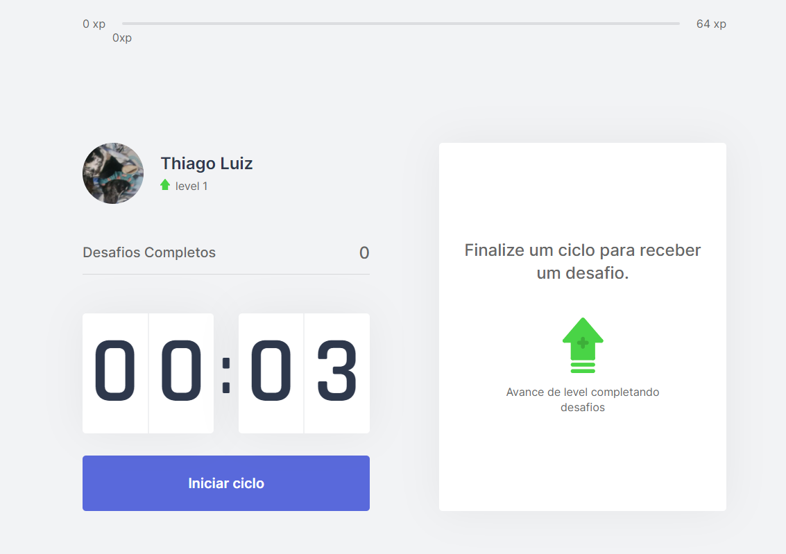

# MoveIt

_pt-br_,

Olá, esse projeto foi realizado no NLW#4 da [Rocketseat](https://rocketseat.com.br/).
Grande experiencia adquirida, pois esse foi meu primeiro contato com o NextJS.
A applicação utiliza a técnica de pomodoro. Que consistem em a cada 25min um exercicio é passado caso você complete o desafio você adiquiri um numero 'x' de experiencia que pode evoluir seu personagem, os dados do usuário são salvos nos cookies do navegador.
Por enquanto o App ainda esta muito generico, mas eu pretendo adicionar novar funcionalidades dele, e deixar ele mais a minha cara.

## App

_local_
**install**

### `yarn install` ou via `npm`

Para instalar todas as dependecias do projeto

### `yarn dev`

Rodar projeto localmente, na [porta 3000](http://localhost:3000).

_Rodando na Vercel_
Basta acessar o link, [moveIt](https://moveit-a5qfye1dg-rpthiagoluiz.vercel.app/), e aproveitar.

_en-us_
Hello, this project was carried out in NLW # 4 by [Rocketseat] (https://rocketseat.com.br/).
Great experience gained, as this was my first contact with NextJS.
The application uses the pomodoro technique. Which consist of every 25 minutes an exercise is passed if you complete the challenge you will get an 'x' number of experience that can evolve your character, and the user data is saved in browser cookies.
For now the App is still very generic, but I intend to add new features to it, and make it look more like me.

## App

_place_
** install **

### `yarn install` or via` npm`

To install all project dependencies

### `yarn dev`

Run the project locally, on [port 3000] (http: // localhost: 3000).

_Rodando na Vercel_
Just access the link, [moveIt] (https://moveit-a5qfye1dg-rpthiagoluiz.vercel.app/), and enjoy.

**Foram Utilizados**

- NextJs,
- TypeScript,

### Prints / Images

